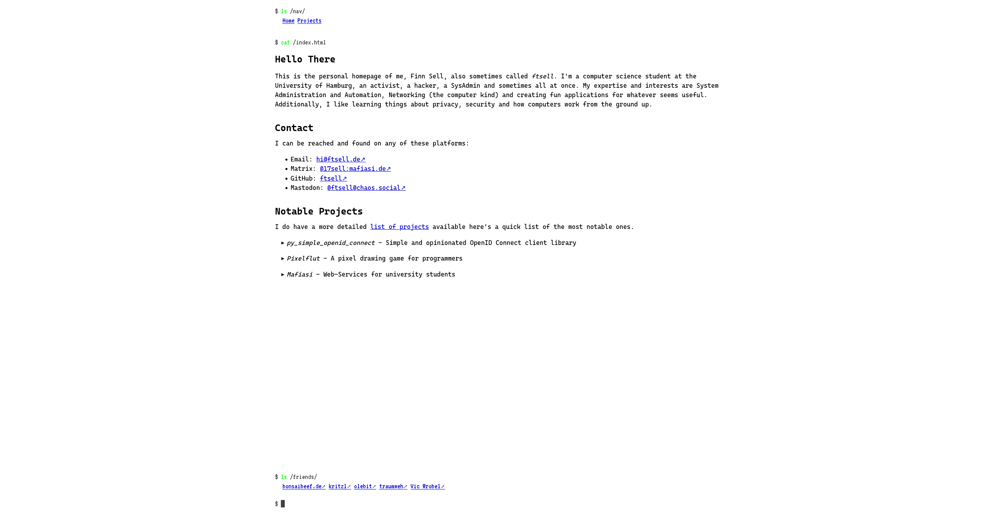

# Homepage

The source repository for my personal homepage at [https://ftsell.de](https://ftsell.de).
This homepage is my personal corner of the internet with which I like to play around and showcase my stuff.
It also includes a little blog on which I occasionally post stuff.

## Technical Details

The homepage has gone through **many** iterations, starting of at plain HTML + CSS, then going to Vue.js, Nuxt.js,
plain HTML again but this time with some fancy vite tooling around it and has by now evolved into a Django application.
The reason is that Django gives me the power to implement exactly what I want while bringing enough to the table so that
I don't have to implement *everything* from scratch.
I'm also just really comfortable with it.

## Running It

The repository contains a Pipfile to define all python dependencies which can be used with *Pipenv* to create a
python virtual environment in which all dependencies are installed. Afterwards, Django's `./src/manage.py` script can
be used to start the server.

For more production-grade deployments, a *Dockerfile* is provided which builds a docker image for the whole application
including static asset serving via nginx.

Additionally, a database is required.
See the relevant environment variable in the configuration table below on how to configure the connection.

## Configuration Details

The application is intended to be configured via environment variables.
The following variables are defined:

| Name                              | Default                           | Required? | Description                                                                                                                                                         |
|-----------------------------------|-----------------------------------|:---------:|---------------------------------------------------------------------------------------------------------------------------------------------------------------------|
| `APP_MODE`                        | `prod` in docker, `dev` otherwise |    yes    | The mode in which homepage operates. **Changing this may affect the defaults of other variables.**                                                               |
| `DJANGO_DEBUG`                    | `False` except in `dev` mode      |    no     | Whether djangos debug mode is enabled ([django debug reference](https://docs.djangoproject.com/en/dev/ref/settings/#std-setting-DEBUG))                             |
| `DJANGO_SECRET_KEY`               | *unset* except in `dev` mode      |    yes    | The django secret key used for cryptographic operations ([django secret key reference](https://docs.djangoproject.com/en/dev/ref/settings/#std-setting-SECRET_KEY)) |
| `DJANGO_ALLOWED_HOSTS`            | *unset* except in `dev` mode      |    yes    | The hostnames that are allowed to connec to the django server ([django allowed hosts reference](https://docs.djangoproject.com/en/dev/ref/settings/#allowed-hosts)) |
| `DJANGO_DB`                       | *unset* except in `dev` mode      |    yes    | A database url for django to connect to ([db url format reference](https://github.com/jazzband/dj-database-url/#url-schema))                                        |
| `DJANGO_CACHE`                    | `locmem://default`                |    no     | A cache url for django to use ([cache url format reference](https://github.com/epicserve/django-cache-url#supported-caches))                                        |
| `DJANGO_ALLOWED_CORS_ORIGINS`     | `[]` except in `dev` mode         |    no     | List of HTTP origins that are allowed to do CORS requests against the django api                                                                                    |
| `DJANGO_TRUST_REVERSE_PROXY`      | `False`                           |    no     | Whether `X-Forwarded-For` headers are to be trusted (enable this if django is running behind a reverse proxy)                                                       |
| `DJANGO_OPENID_CLIENT_ID`         | *unset* except in `dev` mode      |    yes    | The openid client id which django uses to validate authentication tokens                                                                                            |
| `DJANGO_OPENID_CLIENT_SECRET`     | *unset*                           |    yes    | The openid client secret for the configured client id                                                                                                               |
| `OPENID_ISSUER`                   | *ftsell keycloak*                 |    no     | The openid issuer that authors access tokens and which should be consulted for validation                                                                           |
| `DJANGO_ANY_OPENID_USER_IS_ADMIN` | `False`                           |    no     | Whether any user that logs in via openid should be made a django superuser                                                                                          |
| `DJANGO_SUPERUSER_ROLES`          | `[]`                              |    no     | A list of group names whose members should be made django superusers                                                                                                |
| `DJANGO_ALLOWED_METRICS_NETS`     | `127.0.0.0/0`, `::/64`            |    no     | List of IP networks which are allowed to access the /metrics endpoint                                                                                               |

For the values of these variables in `dev` mode, see the configuration in [.env.dev](./.env.dev).
